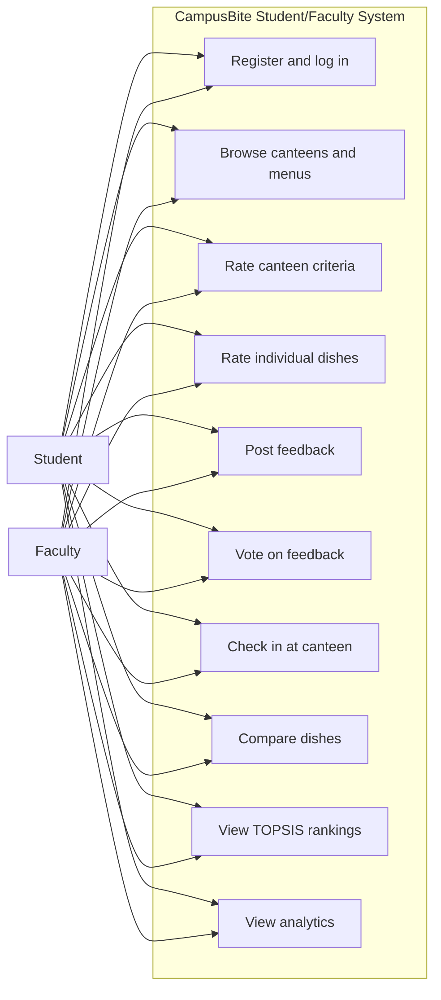
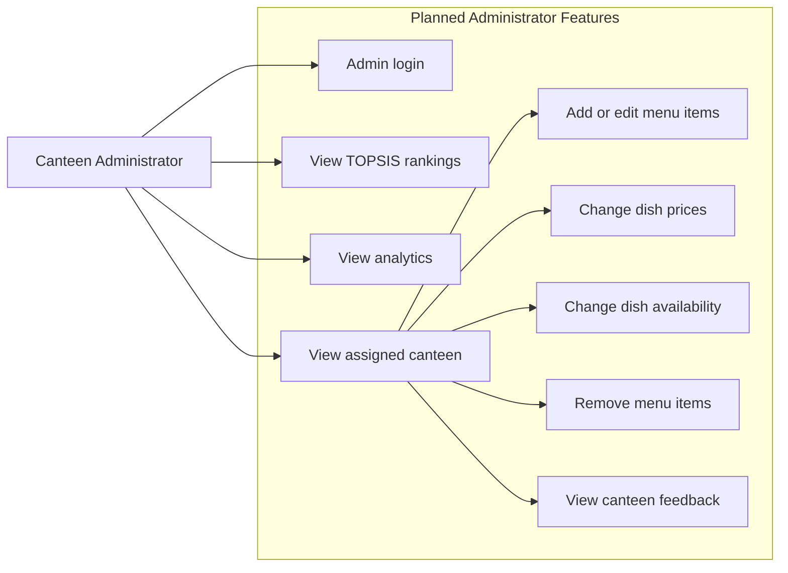
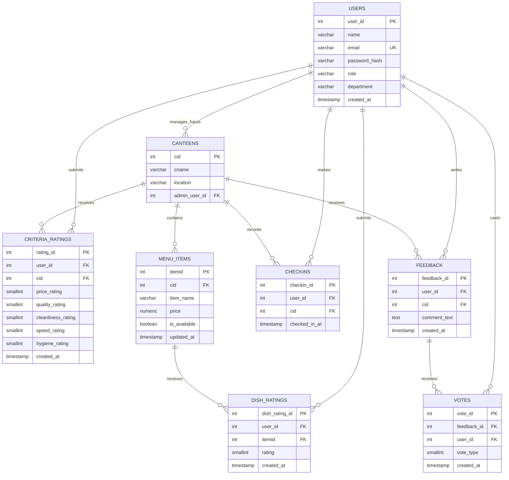

# CampusBite System Design

This document describes the current student/faculty system and the planned administrator features.

## 1. Scope

### Current scope

The implemented application currently supports:

- Student and faculty registration and login
- Viewing canteens and menus
- Viewing dish prices and ratings
- Rating canteens
- Rating individual dishes
- Posting and voting on feedback
- Checking in at a canteen
- Comparing dishes
- Viewing analytics
- Viewing TOPSIS rankings

### Planned administrator scope

Administrator functionality is planned for a later phase. Administrators will be able to:

- Log in as a canteen administrator
- View rankings and analytics
- Update their canteen's menu data
- Change dish prices
- Mark dishes available or unavailable
- Add, edit, or remove menu items
- Review canteen-specific ratings and feedback

An administrator should only edit the canteen assigned to that administrator. The existing `canteens.admin_user_id` column supports this relationship.

## 2. Database tables

| Table | Purpose |
|---|---|
| `users` | Students, faculty, and administrators |
| `canteens` | Campus canteen records |
| `menu_items` | Dishes sold by each canteen |
| `criteria_ratings` | Five-criteria canteen ratings |
| `dish_ratings` | Ratings for individual dishes |
| `feedback` | Written student/faculty reviews |
| `votes` | Likes and dislikes on feedback |
| `checkins` | Canteen visit/check-in records |

Database views and functions provide:

- Canteen criteria averages
- Average menu prices
- Dish ratings by canteen
- Crowd patterns by hour
- Bayesian-adjusted TOPSIS inputs

## 3. Database normalization

The database is designed primarily up to **Third Normal Form (3NF)**.

### First Normal Form (1NF)

The database satisfies 1NF because:

- Each table has a primary key.
- Columns contain atomic values.
- Repeating groups are stored as separate rows.

Examples:

- Each menu item is one row in `menu_items`.
- Each dish rating is one row in `dish_ratings`.
- Each feedback vote is one row in `votes`.

### Second Normal Form (2NF)

The tables satisfy 2NF because:

- They are already in 1NF.
- Non-key attributes depend on the complete primary key.

Examples:

- A menu item's `price` depends on `itemid`.
- A feedback record's `comment_text` depends on `feedback_id`.
- A dish rating's `rating` depends on `dish_rating_id`.

### Third Normal Form (3NF)

The tables satisfy 3NF because:

- They are in 2NF.
- Non-key attributes do not depend on other non-key attributes.

Examples:

- Canteen location is stored in `canteens`, not repeated in every menu item.
- User name and role are stored in `users`, not copied into every rating.
- Dish price is stored in `menu_items`, not duplicated in `dish_ratings`.
- Calculated averages are exposed through views instead of being repeatedly stored in base tables.

### Relationship and junction tables

Some relationships are naturally represented by transaction or junction tables:

- `criteria_ratings` connects users and canteens while storing five rating values.
- `dish_ratings` connects users and menu items.
- `votes` connects users and feedback.
- `checkins` connects users and canteens over time.

This avoids storing lists of users or ratings inside a single column.

### Derived data

The following values are calculated instead of permanently duplicated:

- Average canteen criteria ratings
- Average dish ratings
- Dish value score
- Canteen crowd counts
- Bayesian-adjusted ratings
- TOPSIS scores

These are generated through SQL views/functions and application calculations, which reduces update anomalies.

## 4. Current use-case diagram



## 5. Planned administrator use-case diagram

The following features are planned and are not yet implemented in the current frontend.



## 6. Current ER diagram



## 7. Future administrator data flow

When administrator functionality is added:

1. The administrator logs in.
2. The server reads `req.session.user.id`.
3. The server finds the assigned canteen using `canteens.admin_user_id`.
4. Every update query checks that the menu item belongs to that canteen.
5. The administrator can update only the assigned canteen's menu.
6. Updated prices and availability are immediately used by menus, comparisons, analytics, and future ranking calculations.

Example authorization rule:

```text
current user's ID = canteens.admin_user_id
```

The server must enforce this rule. Hiding buttons in the browser is not sufficient.

## 8. Future admin operations

Planned API operations may include:

```text
GET    /api/admin/canteen
GET    /api/admin/menu
POST   /api/admin/menu
PATCH  /api/admin/menu/:id
DELETE /api/admin/menu/:id
PATCH  /api/admin/menu/:id/availability
GET    /api/admin/feedback
```

These endpoints should:

- Require an authenticated session.
- Require the `canteen_admin` role.
- Verify ownership through `admin_user_id`.
- Validate prices and item names.
- Record `updated_at` changes.
- Return clear authorization errors.

## 9. Design boundaries

The current project should keep these concerns separate:

- **Users and authentication:** `users`, sessions, login APIs.
- **Canteen data:** `canteens`, `menu_items`.
- **User-generated ratings:** `criteria_ratings`, `dish_ratings`.
- **User-generated content:** `feedback`, `votes`.
- **Usage tracking:** `checkins`.
- **Calculated intelligence:** SQL views, Bayesian adjustment, and TOPSIS.

This separation makes it possible to add the administrator panel later without changing the student/faculty rating model.
